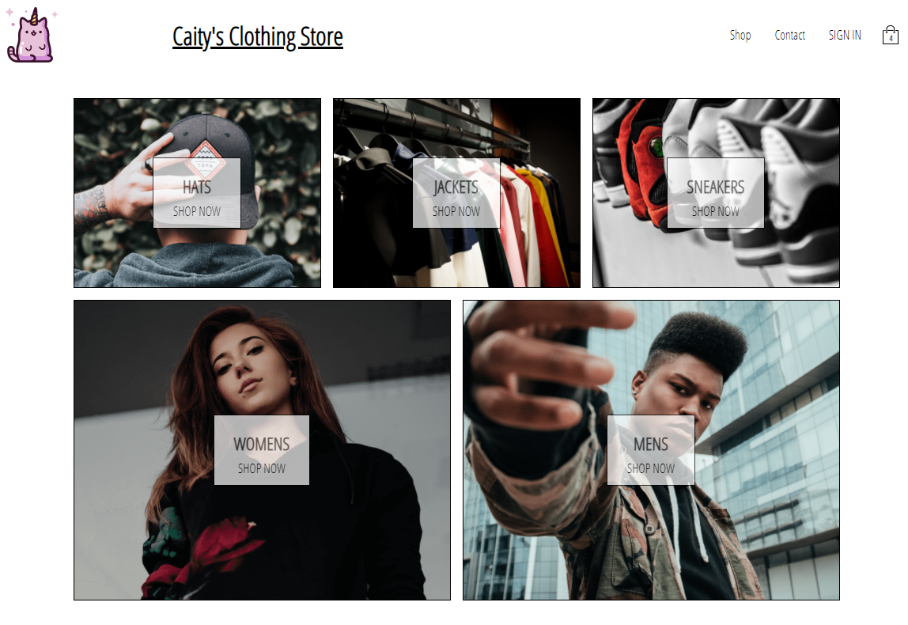
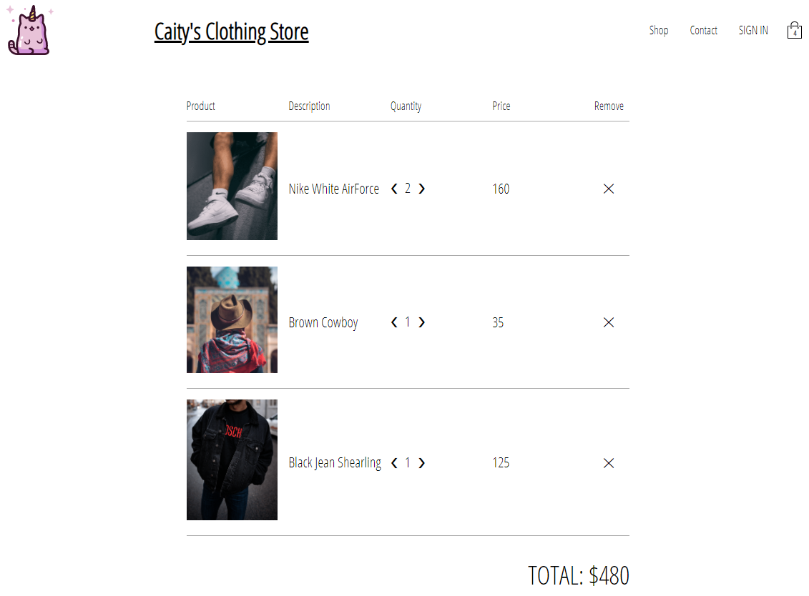

# Caity's Clothing Store

Ecommerce clothing store created with ReactJS, complete with Stripe payment system. This app uses Firebase as a back-end Database, which includes user login, google authentication, and security. Libraries include Redux for state management, Redux Sagas to manage API calls, and React Router to manage views.

## Screenshots:

